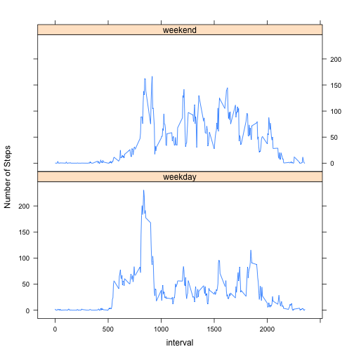

## Loading and preprocessing the data


```r
setwd('/Users/knicoter/RepData_PeerAssessment1')
library(data.table)
```

```
## data.table 1.9.4  For help type: ?data.table
## *** NB: by=.EACHI is now explicit. See README to restore previous behaviour.
```

```r
dt<-data.table(read.csv("./activity.csv"))
```

## What is mean total number of steps taken per day?


```r
#histogram of the total number of steps taken per day
step_sum<-dt[,sum(steps,na.rm=TRUE),by=date]
setnames(step_sum, 'V1', 'date_sum')
hist(step_sum$date_sum, main="Total Taken Steps Per Day", xlab="Steps", ylab="Count")
```

 


```r
#mean number of steps per day
mean(step_sum$date_sum, na.rm=TRUE)
```

```
## [1] 9354.23
```


```r
## [1] 9354
```


```r
#median number of steps per day
median(step_sum$date_sum, na.rm=TRUE)
```

```
## [1] 10395
```


```r
## [1] 10395
```

## What is the average daily activity pattern?


```r
#time series plot of the 5-minute interval (x-axis) and the 
#average number of steps taken, averaged across all days (y-axis)
avg_int<-dt[,mean(steps,na.rm=TRUE),by=interval]
setnames(avg_int, "V1", "interval_mean")
plot(avg_int, type='l', main="Average Daily Activity Pattern", xlab="Interval", ylab="Steps")
```

 


```r
#Which 5-min time interval contains the maximum number of steps?
avg_int[which.max(avg_int$interval_mean)]
```

```
##    interval interval_mean
## 1:      835      206.1698
```


```r
## [1] 835
```

## Imputing missing values


```r
#total number of missing values in the dataset
nrow(dt[is.na(dt$steps),])
```

```
## [1] 2304
```


```r
## [1] 2304
```


```r
#fill in all of the missing values in the dataset
dt<-subset(merge(na_step, interval_average, by="interval"), TRUE,select=c(interval_mean, date, interval))
```

```
## Error in merge(na_step, interval_average, by = "interval"): object 'na_step' not found
```

```r
setnames(dt, "interval_mean", "steps")
```

```
## Error in setnames(dt, "interval_mean", "steps"): Items of 'old' not found in column names: interval_mean
```

```r
dt_clean<-rbind(subset(dt, !is.na(steps)), dt)
summary(dt_clean)
```

```
##      steps                date          interval     
##  Min.   :  0.00   2012-10-02:  576   Min.   :   0.0  
##  1st Qu.:  0.00   2012-10-03:  576   1st Qu.: 588.8  
##  Median :  0.00   2012-10-04:  576   Median :1177.5  
##  Mean   : 37.38   2012-10-05:  576   Mean   :1177.5  
##  3rd Qu.: 12.00   2012-10-06:  576   3rd Qu.:1766.2  
##  Max.   :806.00   2012-10-07:  576   Max.   :2355.0  
##  NA's   :2304     (Other)   :29376
```


```r
#create a new dataset that is equal to the original dataset 
#but with the missing data filled in
step_sum_clean<-dt_clean[,sum(steps,na.rm=TRUE),by=date]
setnames(step_sum_clean, "V1", "date_sum")
```


```r
#make a histogram of the total number of steps taken each day
hist(step_sum_clean$date_sum, main="Total Steps Per Day", xlab="Total Steps")
```

 


```r
#mean number of steps per day
mean(step_sum_clean$date_sum, na.rm=TRUE)
```

```
## [1] 18708.46
```


```r
## [1] 10766
```


```r
#median number of steps per day
median(step_sum_clean$date_sum, na.rm=TRUE)
```

```
## [1] 20790
```


```r
## [1] 10766
```

**Do these values differ from the estimates from the first part of the assignment? What is the impact of imputing missing data on the estimates of the total daily number of steps?**

Yes. A larger mean change is the result of imputing missing data on the estimates of the total number of steps per day.

## Are there differences in activity patterns between weekdays and weekends?


```r
#factor variable with two levels indicating a weekday or weekend
Sys.setlocale("LC_TIME", "en_US.UTF-8")
```

```
## [1] "en_US.UTF-8"
```

```r
dt_clean[,w:=factor(ifelse(weekdays(as.Date(date),abbreviate=TRUE) %in% c("Sat","Sun"), "weekend","weekday"))]
```

```
##        steps       date interval       w
##     1:     0 2012-10-02        0 weekday
##     2:     0 2012-10-02        5 weekday
##     3:     0 2012-10-02       10 weekday
##     4:     0 2012-10-02       15 weekday
##     5:     0 2012-10-02       20 weekday
##    ---                                  
## 32828:    NA 2012-11-30     2335 weekday
## 32829:    NA 2012-11-30     2340 weekday
## 32830:    NA 2012-11-30     2345 weekday
## 32831:    NA 2012-11-30     2350 weekday
## 32832:    NA 2012-11-30     2355 weekday
```


```r
library(reshape2)
stepsmelt<-melt(dt_clean,id.vars=c("w","interval"), measure="steps")
steps_mean<-dcast(stepsmelt, w+interval~variable, fun=mean)

library(lattice)
xyplot(steps ~ interval | w, data = steps_mean,type='l', layout = c(1, 2), ylab="Number of Steps")
```

 
